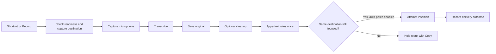

# Amanuensis implementation plan

Prepared September 19, 2026 from the [product brief](product-brief.md) and ten parallel implementation/design investigations. This is the consolidated recommendation for review. Research notes explore alternatives; decisions in this document take precedence where they differ. App code remains the starter project.

Build a native Mac dictation utility whose first useful milestone completes the whole loop: shortcut, microphone, local transcription, S1-mini cleanup, recoverable history, and safe insertion. Then extend the same loop to the remaining models and settings. A working recorder and trustworthy output matter before a complete sidebar of configuration screens.

## Decisions to carry into implementation

| Area | Recommendation | Reason and limit |
| --- | --- | --- |
| Platform | Apple Silicon, macOS 26+ initially; native SwiftUI and AppKit | Matches the available 16 GiB development Mac and modern Apple speech APIs. Intel support is deferred, not silently promised. |
| Distribution | Direct download, Developer ID signing, Hardened Runtime, notarization; App Sandbox disabled | Cross-app Accessibility insertion is central. Validate the signed app before considering this proven. |
| Speech runtimes | Evaluate MLXAudioSTT for Whisper, Parakeet, and Cohere; separate Apple Speech adapter | One candidate package covers the requested downloadable families. Source inspection is not a compatibility test. |
| Local cleanup | Official S1-mini Q4_K_M through embedded llama.cpp | Uses the actual required model without a separately installed app or service. Follow its exact non-thinking input contract. |
| Cloud providers | OpenAI/Groq speech; OpenAI/Claude cleanup | Confirmed scope. Keep provider formats and capabilities separate behind small interfaces. |
| Storage | One SQLite database through GRDB, plus ordinary model/audio files | Explicit transactions, migrations, retention, and crash recovery. Use neither SwiftData nor a second database alongside it. |
| Application state | One observable MainActor dictation owner, with isolated inference and capture work | Every entry point uses the same lifecycle. Views do not run their own recording jobs. |
| Visual direction | Compact native utility, system typography and colors, restrained materials, clear recording status | T3 Code's hierarchy and density are useful references. The desktop UI remains native. |
| Naming | Keep Amanuensis internally until a name is selected | Naming does not block runtime work. See the checked domain shortlist below. |

These choices depend on explicit build and runtime gates. If a candidate fails, use the fallback specified below rather than multiplying runtimes preemptively. Technical evidence: [runtime integration](research/runtime-integration-plan.md), [distribution and insertion](research/insertion-and-distribution-plan.md), [storage](research/storage-and-model-management.md), [module design](research/module-architecture.md).

## Build evidence already collected

The development machine reports arm64 and 16 GiB RAM. Its selected toolchain reports Xcode 26.6, Swift 6.3.3, and macOS SDK 26.5. The repository has project object version 110, deployment target 27.0, Swift language mode 5.0, and MainActor default isolation.

The unmodified starter failed before compilation because this Xcode cannot read project version 110. A temporary copy changed only the project format to 77 and the deployment target to 26.0. That copy built successfully with code signing disabled. This establishes a small compatibility fix for the starter, not a signed-app, dependency, model, or permission test. The working project was not changed.

Apply that compatibility adjustment as the first implementation change, inspect the project diff, then verify Debug and Release builds. Adopt Swift 6 language mode and explicit concurrency ownership incrementally as runtime bindings are introduced. Use the toolchain's `swift-format`; the formatter is available through `xcrun` even though it is not a standalone shell command. Its default two-space indentation flags the unchanged four-space Xcode starter. Add a shared four-space formatter configuration before enforcing it, preserving the existing convention.

## What the app should look and feel like

Start with a 1040 × 740 pt resizable window, a roughly 200 pt sidebar, and 24 pt content insets. Use a small spacing scale of 4/8/12/16/24/32 pt. System typography starts at 13 pt for controls and 15 pt for transcripts. Semantic system colors keep both light and dark appearances coherent. Put materials in the sidebar, toolbar, and floating controls; keep transcript and model content readable on solid backgrounds.

| Screen | Main composition |
| --- | --- |
| Home | A quiet strip for WPM, words, and recording time; current mode/input; the recording action and editable shortcut; Create mode and Add vocabulary. No news feed. |
| Modes | Compact rows showing assigned apps and speech/cleanup selections. The editor puts purpose and models first, with advanced capture/insertion preferences disclosed below. |
| Models | Searchable table, Speech/Cleanup tabs, All/Installed/Local/API filters. Expand the Whisper family rather than displaying every variant initially. Real download progress and errors stay in the row. |
| Vocabulary | Inline entry and compact Words/Replacements views. Show replacements as source → result with clear matching rules. |
| History | Date-grouped list beside a selectable transcript. Result and Original views, visible Copy, metadata below. Collapse to list/detail navigation in a narrow window. |
| Sound | Ordered microphone list, active-input label and meter, explicit exclusions, keyboard-accessible reorder actions. |
| Configuration | Native grouped controls and actual miniature previews for panel, mini, and notch appearances. Shortcut editing is identical here and on Home. |

The mini recorder has Mode, Record/Stop, and Expand controls. Expand means a larger recorder with current input, status, provisional text when available, and completed Result/Original views. Ordinary recording controls do not steal focus. Opening an editable transcript can take focus, which holds the result instead of automatically pasting into an uncertain destination.

Use native focus rings, visible labels, and state text. Meter animation represents actual captured samples. Keep Reduce Motion, Reduce Transparency, VoiceOver, text enlargement, and small-window layouts usable from the first screen. Validate empty, downloading, failed, and disconnected states as carefully as the ideal case. [Visual specifications](research/native-visual-design.md), [T3 Code and other references](research/desktop-design-references.md), [recording interactions](research/recording-interaction-plan.md)

## One recording lifecycle

Resolve mode precedence as direct mode shortcut, explicit manual mode override, matching app rule, then default. The mode picker includes Automatic to clear a manual override. Reject duplicate application assignments initially. Freeze mode, models, microphone choice, vocabulary, replacements, and insertion settings for the recording. Changes affect the next recording, except a stricter local-processing policy takes effect immediately.

Release during push-to-talk preparation cancels preparation. It must never start recording after the user releases the keys. While busy, reject another start rather than queueing a surprise recording. Every asynchronous result carries a session identity; cancellation invalidates that identity immediately and forbids late insertion. Native work may take longer to stop, so keep its resources leased until it actually exits.

On microphone loss, stop and preserve captured audio, then offer transcription of the captured part or discard. Do not splice in another microphone silently. A newly connected preferred microphone affects the next session. Excluded inputs are never fallback candidates.

Persist raw text before cleanup. Distinguish no speech, cleanup error, and valid empty S1-mini output. Valid empty cleanup means Nothing to insert, with raw text still inspectable. Apply longest whole-phrase replacements in one noncascading pass to the chosen final text, then insertion capitalization. A failed insertion must not rerun speech recognition or cleanup.

The first version has one active recording or history retry job. Cancel restores only the playback settings the app changed. Playback pause is limited to supported players; Keep playing is the conservative initial default. Meeting capture must not pause the system audio it is supposed to record.

A history retry is an explicit user action. Start from the entry's frozen settings, require the original artifacts to remain available, and check today's processing policy before dispatch. If an artifact is missing, offer an explicit model selection; never silently use the current default or a cloud replacement. Show whether retry will send saved audio or text to a provider before the user starts it. Save a new attempt without overwriting the original result, and count the recording at most once in usage totals. Retry results stay in History with Copy; automatic insertion is disabled. A separate explicit Insert action captures and validates a new destination.

## Modules and data ownership

| Module | Interface and responsibility |
| --- | --- |
| `DictationSession` | `start`, `finish`, `cancel`, and observable state. Owns session identity, frozen settings, stage transitions, and delivery eligibility. |
| `AudioCapture` | Capture, finish/cancel, metering and interruption events. Owns input selection and bounded capture buffering. |
| `SpeechRuntime` | Transcribe an audio asset with declared capabilities. Real adapters vary across local engines, Apple, OpenAI, and Groq. |
| `CleanupRuntime` | Clean text with a validated format request; return text, valid empty, or error. S1-mini controls differ from general prompts. |
| `ModelLibrary` | Catalog, install/import/remove, readiness, and runtime leases. Owns complete artifacts, checksum verification, and attribution. |
| `TextDelivery` | Capture destination and attempt insertion. Owns Accessibility checks, focus revalidation, clipboard ownership, and delivery outcome. |
| `LocalStore` | Persist settings/session results, query history, expire/delete records, and update usage aggregates. One GRDB queue; no per-screen repository framework. |
| `CloudAccess` | Provider requests, credential lookup, cancellation, redaction, and current-policy checks immediately before dispatch. |

Keep protocols at the two runtime seams and where tests need to simulate hardware or delivery failures. Start with one app target and feature folders. Extract a small runtime-binding package only where required for the C framework or package isolation. Do not build a general workflow engine.

Store modes, vocabulary, rankings, installation metadata, and history in the database. Window/appearance preferences may live in UserDefaults; provider secrets live only in Keychain. Large model/audio assets live in Application Support. Managed-copy import preserves the source and keeps the app independent of removable drives. External-folder references can follow once their disconnection behavior is designed.

Proposed initial retention defaults are seven days for audio and until deleted for text, shown during setup. Explicit Delete recording removes both. Retention and deletion use recoverable jobs; crashes cannot make deleted history reappear through late inference. Canceled sessions retain no content by default. Interrupted sessions retain captured audio under the retention policy.

Home's three metrics cover completed dictation sessions: cumulative dictation minutes, raw dictated word count, and weighted WPM. Meeting recordings do not contribute to these totals because remote speakers and meeting duration would distort personal dictation speed; their duration and transcripts remain in History. Use small content-free usage aggregates so audio/text expiry does not make All time totals shrink. Count each session once even when retried. Delete history does not reset aggregates; provide a separate Reset usage action and state that behavior. The label Dictation time resolves the earlier ambiguous Time spent wording. These defaults are proposed product decisions.

## Model and privacy contract

Required local speech coverage is all twelve official Whisper checkpoints, Parakeet TDT 0.6B v2/v3, Cohere Transcribe 03-2026, and Apple recognition. Aliases such as Whisper large/turbo do not create duplicate installations. Select exact quantized artifacts only after testing them on the 16 GiB machine. Do not equate file size with runtime memory.

Use the official S1-mini Q4_K_M artifact, preserving its license/notice and required name attribution. Its four tone settings, prose/lists structure, and general/email context are the supported editor controls. It is not a general custom-prompt or meeting-summary model. Check the exact prompt tokens and outputs against the author's documented runtime. Test filler-only and long-input handling explicitly.

MLXAudioSTT is the first candidate for downloadable speech models. Start with sequential speech-model and cleanup-model residency; only keep both warm after memory measurements support it. Its loader can fetch tokenizer assets, and some streaming methods wrap synchronous generation. Therefore an async method or a local folder does not establish UI responsiveness, cancellation, or offline behavior.

Initial imports accept validated complete formats supported by adopted runtimes, including speech-model directories and S1-mini GGUF. Generic Whisper `.pt`, whisper.cpp `.bin`, Core ML bundles, and MLX folders are not interchangeable. If direct `.bin` import becomes necessary, add a tested whisper.cpp adapter rather than falsely accepting the file.

Local is a library filter. Require local processing is a separate execution control that rejects both cloud speech and cloud cleanup and never falls back to cloud. Recheck it at request dispatch. Enabling it cancels active cloud requests, but cannot retract data already sent. Downloads and updates are separate network operations. Optional Ollama support is later work; localhost alone cannot prove inference is local.

## Implementation order and gates

| Milestone | Deliverable | Completion gate |
| --- | --- | --- |
| 0. Build foundation | Compatible project settings, Swift formatting/concurrency checks, isolated runtime build hosts, test target | Debug/Release build; Metal resources load in an app launched outside Xcode; no unreviewed dependency graph drift. |
| 1. Prove risky integrations | S1-mini exact-artifact smoke test, Cohere/Parakeet/Whisper small fixtures, signed cross-app paste spike, microphone/PTT spike | Correct prompt behavior; actual offline runs; measured memory/cancellation; clipboard and focus tests in real apps. Failed gates choose a documented alternative. |
| 2. First useful local app | Home, initial setup, mini recorder, one validated speech option plus S1-mini, microphone priority, shortcut, copy/paste recovery, durable basic history, audio/text retention enforcement and deletion | Complete repeated dictations without focus theft, lost output, UI blocking, or background microphone leakage. Retention and deletion already work on captured data. This is the first hands-on review build. |
| 3. Complete requested local workflows | Full model library and imports, twelve Whisper entries, Parakeet v2/v3, Cohere, Apple, modes, app rules, vocabulary, full retention controls and configuration | Every advertised model artifact passes its manifest test; modes and history survive relaunch; all local paths work offline after setup. |
| 4. API choices and polish | OpenAI/Groq speech, OpenAI/Claude cleanup, scoped key/model tests, complete visual layouts, notch and expanded recorder | Local policy prevents remote dispatch; failures retain original output; accessibility/light/dark/display checks pass. |
| 5. Meetings and distribution | Mic/system audio capture, supported playback behavior, optional speaker labeling, updater and signed release | Real mixed-audio/device-loss tests; editable speaker output if shipped; notarized install/update succeeds. |

Optional general local cleanup via Ollama can follow the mandatory S1 path. Website-specific rules, mouse/modifier-only shortcuts, and Intel support remain extensions, not hidden prerequisites for the first useful build. The research phase does not count unimplemented model rows as delivered support.

Fallbacks are specific. If MLX Whisper accuracy/cancellation fails, evaluate WhisperKit or whisper.cpp. If MLX Parakeet fails, evaluate FluidAudio. If the Swift Cohere path fails, compare it with the upstream reference and evaluate a corrected/pinned Swift runtime or a packaged local helper using the documented Python MLX path. That helper is an alternative requiring its own packaging and performance proof, not an assumed fix. If no local Cohere path passes, milestone 3 and the complete requested release remain blocked on that requirement; continue independent work without silently dropping Cohere. If native inference cannot stop predictably, evaluate helper-process isolation. No fallback changes local processing into a cloud request. Candidate revisions and build details are in the [runtime plan](research/runtime-integration-plan.md).

## Validation and work split

Use Swift Testing for text rules, mode precedence, state transitions, retention, duplicate-count prevention, stale-result rejection, and privacy policy. Use real temporary databases for migrations and deletion tests. Use XCTest/XCUI for navigation, keyboard operation, setup, and critical recorder UI. Microphone routing, Accessibility, Spaces, Bluetooth, signed insertion, and GPU memory require actual Mac sessions.

Keep a consented or synthetic audio fixture set for silence, names, numbers, negation, corrections, accents, long speech, and overlapping speakers. Measure cold/warm model loading, stop-to-result and stop-to-insertion latency, memory, WER, and meaning-preserving cleanup. Results must name the hardware and exact artifacts. Do not invent speed/accuracy bars or market a best-case number as normal performance. [Validation plan](research/validation-and-release-plan.md)

After the initial contracts and risky spikes, parallelize four implementation tracks: model acquisition/inference; capture/shortcuts/delivery; persistence/history; SwiftUI screens. Each track owns distinct files. One integration owner maintains DictationSession and the composition root. Require a working whole-loop demo at each merge point; avoid four disconnected implementations of recording state.

## Names and domains

Working shortlist: Sayspan, Sayfern, and Utterleaf. Sayspan is the preferred compact utility name; Sayfern suggests a softer visual identity; Utterleaf is more distinctive but needs a spoken-spelling check. The researcher checked their `.app` and `.com` candidates through registry RDAP and DNS and found no registration records at the recorded check time. This does not reserve them or establish purchasability. No purchase or rename occurred.

The adjacent name Amanu already belongs to a local Mac dictation product, so avoid shortening Amanuensis to Amanu. Keep the existing internal project name while the public name is reviewed. Exact domain evidence, sources, and limitations are in [names and domains](research/names-and-domains.md).

The plan is ready for design and architecture review. Runtime adoption remains conditional on milestone 1; no model performance, signed insertion, or production readiness has been claimed from documentation alone.
